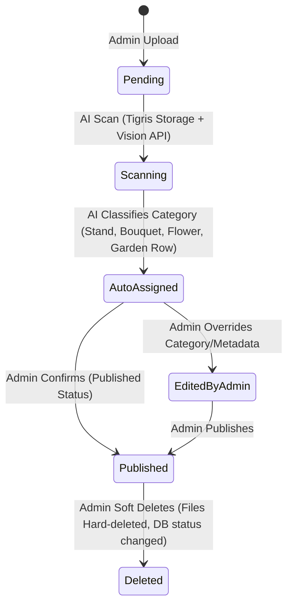
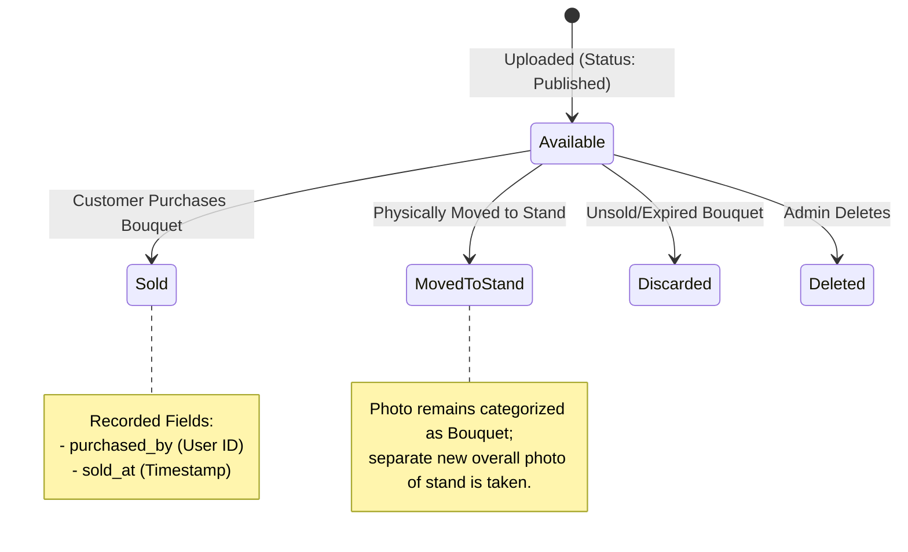
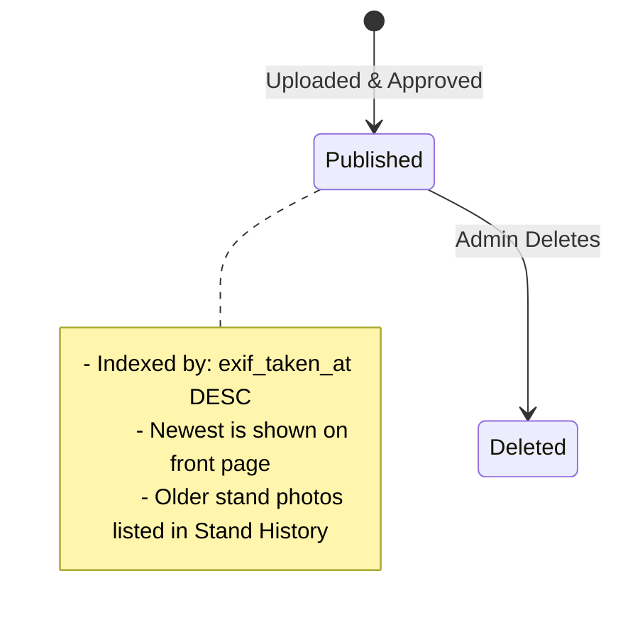
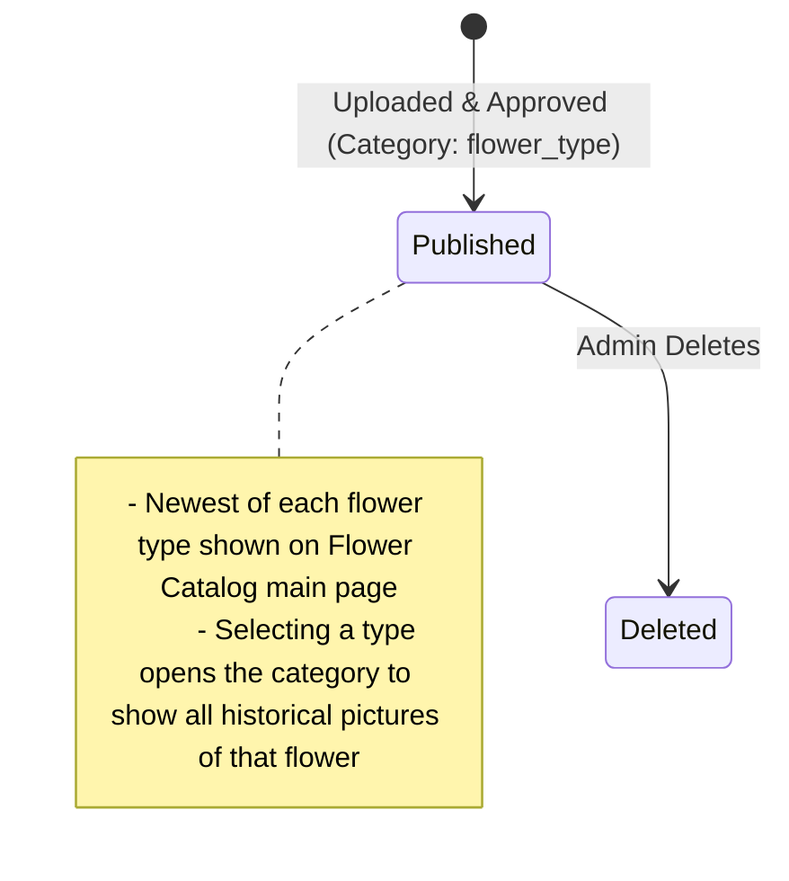
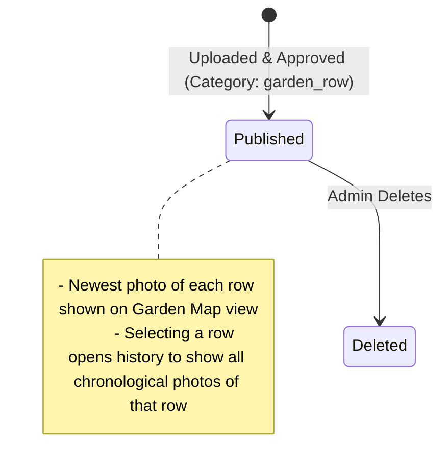

# Fleurraine Photo Workflow & Status Flow Specification (v1.0)

This document serves as the master specification for the Fleurraine image status workflow, database schemas, performance indexing, deep-linking / sharing mechanics, and the Customer Companion App User Guide. It provides clear diagrams and executable SQL query snippets for system administrators.

---

## 1. Photo Status Flow & Lifecycle Diagrams

Every image uploaded by an administrator undergoes automatic classification by our AI engine or can be manually modified by the admin. The following state diagrams illustrate how the system acts on classifications, handles manual adjustments, and transitions states securely.

### 1.1 Core Upload & Classification Flow

When an admin uploads a photo, it starts in the `pending` status. The AI classifies it and populates suggestions. When approved or edited, it transitions to `published`.



---

### 1.2 Category: Bouquet Lifecycle
A bouquet photo requires a **4-digit bouquet number** and a **price in cents**.



---

### 1.3 Category: Flower Stand (Chronological Status)
Flower stand images capture the physical state of the stand over time.



---

### 1.4 Category: Flower (Species & Flower Catalog)
Images representing specific flower types. Multiple flower types can exist in a single photo, stored in the `flower_names` array.



---

### 1.5 Category: Garden Row
Images tracking specific beds/rows in the garden. Multiple row numbers can exist in a single photo, stored in the `row_numbers` array.



---

## 2. Physical vs. Soft Deletion Mechanics

When an administrator deletes a photo, Fleurraine performs a hybridized deletion flow designed to satisfy audit compliance, clean up storage costs, and prevent broken consumer views or dead links.

### How Deletion Works Behind the Scenes:
1. **Physical binary hard-delete**: The backend immediately deletes the original, mobile, and thumbnail image files from S3/Tigris storage to release space and guarantee that deleted images can no longer be downloaded.
2. **Metadata soft-delete**: The record in the `photos` table is kept but updated:
   - `deleted_at` is set to the current timestamp (`now()`).
   - `deleted_by_email` is set to the deleting administrator's email.
   - `status` is updated to `'deleted'`.

### Why this approach is used:
* **No Broken Links**: When a consumer accesses an old shared deep link or bookmark (e.g., `/photos/<uuid>`), the server returns the metadata of the photo but indicates it has been deleted. The frontend can render a graceful, clean page saying **"This image has been removed by the administrator."** instead of crashing with a `404` or displaying a broken image thumbnail.
* **Filtered Consumer Views**: Public query lists automatically exclude deleted items by filtering on `WHERE deleted_at IS NULL AND status = 'published'`.

---

## 3. Database Architecture & Indexing

To support fast grouped and categorized views (such as showing the newest photo of each individual flower species or garden row when multiple elements can belong to one photo), Fleurraine uses array fields with **Generalized Inverted Indexes (GIN)**.

### 3.1 Schema Representation
* **Flower Types**: Stored as `flower_names TEXT[]` (an array of flower names found in the image).
* **Garden Beds**: Stored as `row_numbers INTEGER[]` (an array of bed row numbers).

### 3.2 High-Performance Indexes
In standard B-tree indexes, queries searching within arrays are slow because PostgreSQL must scan every row. Fleurraine utilizes GIN indexes:

```sql
-- Index for querying multi-flower photos instantly
CREATE INDEX IF NOT EXISTS idx_photos_flower_names 
ON photos USING GIN(flower_names) 
WHERE flower_names IS NOT NULL;

-- Index for querying multi-row photos instantly
CREATE INDEX IF NOT EXISTS idx_photos_row_numbers 
ON photos USING GIN(row_numbers) 
WHERE row_numbers IS NOT NULL;
```

These GIN indexes map individual array values back to the parent rows. When a user requests pictures containing `"Dahlia"`, Postgres can immediately look up the Dahlia index entry and pull only the relevant photo IDs.

---

## 4. Navigation, Sharing, and Deep Linking

Navigating and sharing content is a first-class feature in the Fleurraine PWA:

### 4.1 Flower Stand Chronology & Front Page
1. **Front Page**: Displays the single latest, most recent published photo categorized as `'stand'`.
2. **Accessing History**: A link is provided under the main photo: **"View Stand History"** or **"See Older Photos"**.
3. **Stand History Page**: Displays a chronological grid of all historical stand pictures, ordered by `exif_taken_at DESC` or `uploaded_at DESC`.

### 4.2 Sharing Content
Each photo possesses a unique, random `share_token` and an action menu that leverages the **Web Share API**:
* When a user taps the **Share Icon** (🔗) on any photo detail page, the app generates a clean public permalink (e.g., `https://fleurraine.app/photos/<uuid>` or uses the `share_token` URL).
* This provides full rich-preview support on messaging platforms and loads the single photo detail page instantly for the recipient.

---

## 5. Flower Stand Companion App User Guide

Welcome to the **Fleurraine Flower Stand Companion App**! Use this guide to easily browse, purchase, and review beautiful fresh flowers straight from our physical stand.

### 🌸 5.1 Browsing the App
* **Stand View**: Open the app to immediately see the current photo of the physical stand to check what bouquets, flower jars, or single stems are on display before you travel.
* **Flowers Catalog**: Tap the **Flowers** tab to see what species are currently in bloom. You can tap on any species (e.g., *Tulips*) to read its description and view historical catalog photos.
* **Garden Map**: Tap the **Garden** tab to browse pictures organized by garden rows, letting you see exactly how the fields look and what rows are currently peaking.

### 💐 5.2 Purchasing a Specific Numbered Bouquet
1. Locate the physical bouquet at the stand and look for its **4-digit bouquet number** (e.g., `1204`).
2. In the app, tap the **Bouquets** tab.
3. Locate bouquet `#1204` or type it into the search bar.
4. Review the details, price, and flower types included.
5. Tap **Buy Now** to purchase using Apple Pay, credit card, or your digital wallet.

### 🍯 5.3 Quick Payment for a Unnumbered Bouquet or Flower Jar
* If you selected a beautiful jar of loose flowers or an unnumbered bouquet from the physical stand:
  1. Tap the **Quick Pay** button on the home screen or under the **Bouquets** tab.
  2. Select the item category (e.g., "Flower Jar" or "Standard Bouquet").
  3. Confirm the default price or enter the amount listed physically on the stand.
  4. Complete payment securely in seconds.

### 📦 5.4 Order History
* Tap your profile icon or navigate to the **Orders** tab.
* Here you can view a complete timeline of your purchases, payment receipts, and the dates of your visits to the stand.

### ⭐ 5.5 Posting a Review with Photos
Help us grow and share your joy! Once you've purchased a bouquet:
1. Go to your **Orders** history.
2. Select your purchase and tap **Write Review**.
3. Give us a star rating, type a message, and snap a picture of the flowers in your home!
4. Tap **Submit Review**. Once approved by the administrator, your photo will be featured in our community review feed.

---

## 6. Admin SQL Diagnostics & Correction Snippets

Use these copy-pasteable PostgreSQL query snippets to audit, monitor, and correct photo data states in the backend.

### 6.1 View Active vs. Sold Bouquets
Find all bouquets currently available on the stand versus those that have been sold.
```sql
SELECT id, bouquet_number, price_cents, status, sold_at, purchased_by 
FROM photos 
WHERE category = 'bouquet' AND deleted_at IS NULL
ORDER BY bouquet_number ASC;
```

### 6.2 View Stand Photo History Chronology
List all stand photos to verify chronological order and find the current homepage image.
```sql
SELECT id, exif_taken_at, uploaded_at, status, storage_key_orig 
FROM photos 
WHERE category = 'stand' AND deleted_at IS NULL
ORDER BY COALESCE(exif_taken_at, uploaded_at) DESC;
```

### 6.3 Find Photos Containing a Specific Flower Type
Query photos containing a specific flower type (utilizing the GIN index).
```sql
SELECT id, category, flower_names, uploaded_at 
FROM photos 
WHERE 'Dahlia' = ANY(flower_names) AND deleted_at IS NULL;
```

### 6.4 Find Photos Displaying a Specific Garden Row
Query photos that belong to a specific garden bed (utilizing the GIN index).
```sql
SELECT id, category, row_numbers, uploaded_at 
FROM photos 
WHERE 3 = ANY(row_numbers) AND deleted_at IS NULL;
```

### 6.5 Correct a Mislabeled Category (e.g., Flower Type back to Stand)
If an image was incorrectly categorized, run this query to re-designate it.
```sql
UPDATE photos 
SET category = 'stand', flower_names = NULL, row_numbers = NULL
WHERE id = 'INSERT-PHOTO-UUID-HERE';
```

### 6.6 Manually Mark a Bouquet as Sold
If a customer paid physically or offline, mark a bouquet as sold manually.
```sql
UPDATE photos 
SET status = 'sold', sold_at = NOW(), purchased_by = 'INSERT-USER-UUID-HERE'
WHERE id = 'INSERT-PHOTO-UUID-HERE' AND category = 'bouquet';
```

### 6.7 Restore a Accidentally Deleted Photo (Soft-delete rollback)
If an admin accidentally deleted a photo, restore its database record (Note: storage files must be re-uploaded since storage binaries are hard-deleted).
```sql
UPDATE photos 
SET deleted_at = NULL, deleted_by_email = NULL, status = 'published'
WHERE id = 'INSERT-PHOTO-UUID-HERE';
```
